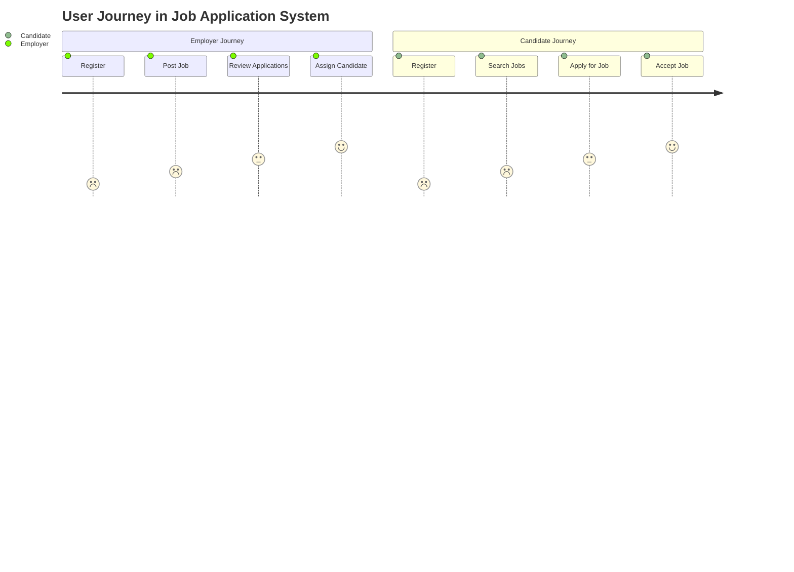
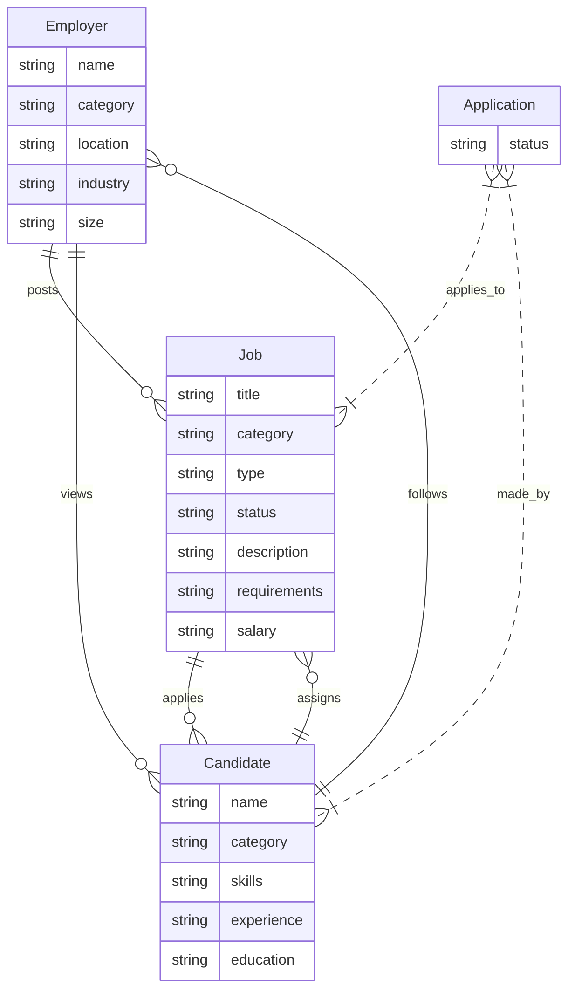

# Overview

This This project shows the beginning stages of **bootstrapping** a individual project. It is a simple HTML/CSS project that uses [TailwindCSS](https://tailwindcss.com/) as a CSS framework. It's beginning overview will only show HTML, but will be updated to include CSS and JS as well.

## Description

This project is a simple HTML/CSS project that uses [TailwindCSS](https://tailwindcss.com/) as a CSS framework. It's beginning overview will only show HTML, but will be updated to include CSS and JS as well. Eventually this project will be a full stack project that will include a backend and database, and may even be switched to a separate repository.

## Purpose

The project concept is to create a recruiting platform for the production staff of filming crews in the New England region of Northern America. The objective, is to help fill an otherwise empty void in the industry, and to help connect people with jobs. As it progresses, it will be updated with Javascript, tailwindCSS, SQL, React, and Node.js. At it's deployment, I hope this project will help fulfill both my journey into the world of web development, but also help others find work in their respective industry.

## User Journey



## Wireframe



## Personal Starting Checklist

- [x] Bootstrap the project `mkdir  .....`
- [x] Install TailwindCSS (TW)
  - 1. (Node & yarn)
  - 2. `yarn add -D tailwindcss && npx tailwincss init`
  - 3. update tailwind.config.js (`content: []` block)
  - 4. Add my tailwind.css stuff (@tailwind ....)
  - 5. `npx tailwindcss -i ./tailwind.css -o ./styles.css --watch`
  - 6. add my `link:css` point to `./style.css`
  - 7. Do some backflips (highly optional)
- [x] Setup HTML semantic structure
- [x] Create a User Journey with a flowchart
- [x] create a wireframe of the project
- [ ] (TBD)

# Setup

## Setup TailwindCSS

This guide provides a step-by-step process on setting up TailwindCSS for your project. Please follow the instructions below:

## Prerequisites

- Ensure you have Node.js and npm installed on your system. If not, download it [here](https://nodejs.org/).
- If you're on Windows, install [Git Bash](https://gitforwindows.org/).
- Make sure you have a code editor installed, like [Visual Studio Code](https://code.visualstudio.com/) or [WebStorm](https://www.jetbrains.com/webstorm/).

## Installation Steps

1. **Install Yarn:** Open the command-line (On Windows, it's "Git Bash". On a Mac, open "Terminal") and type the following command to install Yarn globally:
   ```
   npm install --global yarn
   ```
2. **Create a new project folder:** From your command-line, create a new folder for your project (for example, "setup-tailwindcss") and navigate into the folder.
3. **Install TailwindCSS package:** While in the folder, type the following command to install the TailwindCSS package:

   ```
   yarn add -D tailwindcss
   ```

   _Note: This command is slightly different from what is in the official documentation._

4. **Initialize TailwindCSS:** Still in the terminal, type the following command to create a "tailwind.config.js" file:
   ```
   npx tailwindcss init
   ```
5. **Open your project in a code editor:** Open your project folder in your code editor (VS Code or Webstorm).
6. **Check your project structure:** At this point, your project should look like this: [Project Structure](https://asciinema.org/a/uerF6IYQpK0UavKYenfQvYC5M)
7. **Update Tailwind configuration:** With the project open in your code editor, open your `tailwind.config.js` file and replace the `content: [],` line with:
   ```javascript
   content: ["./src/**/*.{html,js}", "./*.{html,js}"],
   ```
8. **Create a tailwind.css file:** Now, create a `tailwind.css` file with the following content:
   ```css
   /* tailwind.css */
   @tailwind base;
   @tailwind components;
   @tailwind utilities;
   ```
9. **Dynamically generate a styles.css file:** Finally, from the terminal, run the following command to generate a `styles.css` file from `tailwind.css`. This command also watches for changes and rebuilds as needed. Leave this process running during development:
   ```
   npx tailwindcss -i ./tailwind.css -o ./styles.css --watch
   ```

That's it! You've successfully set up TailwindCSS for your project. Happy coding!

# Contact

email me at: [amagown@gmail.com](amagown@gmail.com)
